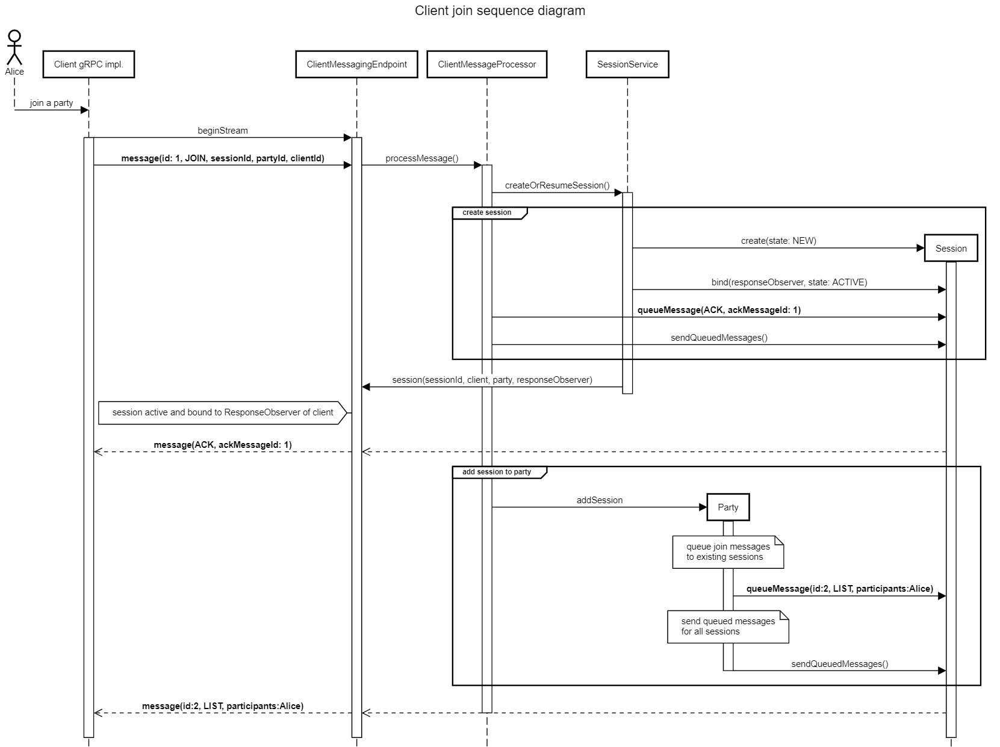
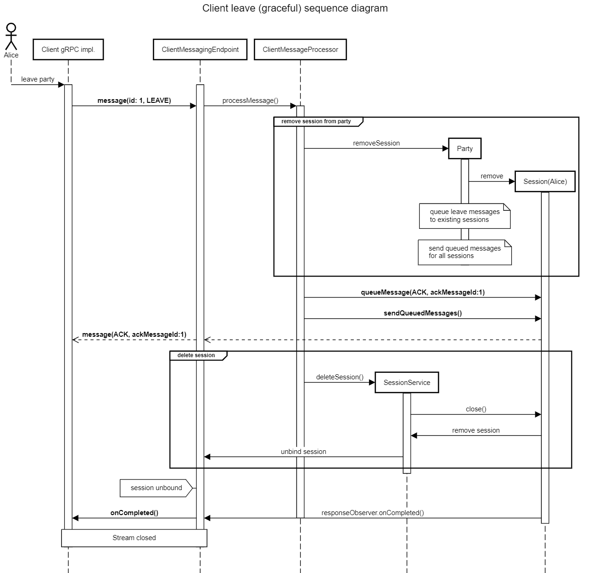

# PartyPresenceMessageBroker

### a party participant presence service


## Overview

**PartyParticipantMessageBroker** is a backend service for distributing presence messages between participants of an external shared multi-client session, otherwise referred to as a 'party'. When a client joins a party, an online message is broadcast to other participants in the party. Similarly, when a client leaves a party by leaving or via session timeout, an offline message is sent to other clients.

### High level design

1. Requirements
   * When a **client** 
     * joins a **party** by sending the message broker a connect message
       * all subscribed **client**s of **party** get a message that the client joined the party
       * the new **client** is subscribed to receive messages sent to **party**.
     * leaves the **party** by sending the message broker a disconnect message, or
     * did not send any messages to, or did not acknowledge any messages sent to the **party** for 120 seconds
       * the **client** is unsubscribed from the messages delivered to the **party**
       * all subscribed **client**s get a message indicating the client left the party

#### Considerations

* When a client joins a party, the client should receive a welcome message with other clients currently present in the party.
* When a client receives a message from the party, it should send back an acknowledgment indicating successful delivery of the message.
* All clients must implement a keep-alive ping timer, with duration half of the session TTL, and send a ping message to the broker on timer expiry.
* When a party receives a "leave" message from a client, the party should immediately unsubscribe the client, and broadcast a message that the client has left.
* When a party detects that a client has not been acknowledging any messages sent to it for 120 seconds it must consider the client disconnected, unsubscribe the client and publish a message that the client has left.
* The party shall include the reason for leave in the published leave message; however it's up to the other clients' implementation to present the reason for leave to the end user.
* The party must guarantee at-least-once delivery of each message
* Each message must include a deduplication identifier to prevent clients from processing it more than once

### Architecture

#### Definitions

1. In order to achieve the required functionality, the following definitions are made:
   * **client**: software running on an end user edge device that has a unique identifier, can connect and send messages to, and receive messages from, a message broker
   * **party**: an abstract messaging entity that the clients can subscribe to, and receive messages from while subscribed
   * **message broker**: a backend application capable of:
     * accepting multiple client connections with keep-alive functionality
     * accepting client join/leave messages to/from parties
     * broadcasts messages sent from one client to every other client in the same party
     * providing message order guarantee within a party
     * appending deduplication IDs to each broadcast message
     * appending timestamp to each broadcast message

#### Assumptions

While designing the backend architecture, the following assumptions have been made.

* A client may want to hold multiple sessions to a party (most likely from different edge devices, such as a laptop + a phone + a tablet etc.) and party notifications should be delivered to all sessions owned by the client.
* The underlying network, especially with mobile connections, might be very unreliable, therefore a client acknowledgment is required for every message sent to the client.
  * The client may acknowledge multiple messages at once.
  * Messages should have a maximum retry count and the broker must retry the messages up to that count until acknowledged. (This is not fully implemented in the reference implementation)
* The transport may drop without any indication but the client would probably want to re-establish its existing session as soon as possible.
* There must be some sort of authentication and authorization mechanism for the client connection (again not implemented, out of scope)
  * JSON web token authentication is easily pluggable into gRPC services
* Messages must be kept small, so the message broker should only broadcast a unique identifier for every client.
  * It's fully assumed that the client would have access to another backend service that it can use to fetch details such as username and profile picture about the client, using the unique client identifier in the messages.
  * The client would use the same JWT to access this service to fetch client names and profile pictures.

### Implementation

The message broker is implemented using the Micronaut framework with streaming gRPC calls shuffling protocol buffers back and forth.

Each stream is associated with a session in the backend service. A session consists of a unique session identifier, a client reference, a party reference, outgoing and inflight message queues, and a timeout timer.

When a client opens a stream to the server, the first message expected by the server is a `JOIN` message. A join message must contain a unique session identifier, a client identifier and a party identifier. If the session identifier is already in use, an error message is sent back and the client is disconnected.

Upon successful creation of a session, the server will bind the client's response observer to the session, and send an `ACK` message for the client join message. The server will also send a `LIST` message as the second message, that contains the list of clients currently in the party.

The last message expected by the server is a `LEAVE` message. When a leave message is received, the session is removed from the party and the clients will receive a `LEAVE` message.  The clients can then display the notification in any way they desire.

If a gRPC call is closed without an explicit leave message, the session associated with the stream is kept in an inactive state for (a configurable length of time, but set by default to) 120 seconds. In this case, the other clients will not immediately receive a leave message. 

The client can reconnect with the same session ID before it expires, and resume its session. If the session times out, the other clients will receive a `LEAVE` message with an optional status code field, indicating session timeout as the leave reason. It is up to the client implementation to display this information in its UI or not.

The session timeout applies even when the stream is connected, and only resets when a valid message is received from the client. As such, if no communication has happened in the stream for a while, the client must send a `PING` message on its own accord to keep the stream from timing out.

It's up to the client as to how often should a ping message be sent; however it's recommended that the interval set to half of the session timeout, or 60 seconds.

Sessions are unique per ID per client per party. Therefore if the client wishes to join another party, it must open a new stream.

All wire messages must contain a deduplication ID unique to the stream (even though the retry mechanism is not implemented). The server will respond with an `ACK` or an `ERROR` message to all client messages. Clients must also ack messages sent to them. A client can ack multiple messages in a single wire message. A client can ack a message ID more than once; subsequent calls will have no effect.

An in-memory key value store such as Redis was considered but (quite, quite regrettably) not used in the implementation due to time constraints. Keeping the session store in a distributed Redis cluster would make the service easily horizontally scalable.

#### Messaging

The following protocol buffer definition is proposed as the stream wire message type.

All wire messages have the same definition; however there's a message type field that differentiates the intention of the message.

```protobuf
message ClientMessage {
  // Client generated identifier, only required on the first message from the client to the stream.
  // If a stream is ungracefully disconnected and the session TTL has not elapsed, the client should
  // use the existing id to resume a previous stream.
  fixed64 session_id = 1;

  // Unique immutable client identifier that always refers to the message originator. Must be set by the client in the
  // initial JOIN message. Should not be set in any other message from client to broker.
  fixed64 client_id = 2;

  // Unique immutable party identifier. This field must be set by the client in the initial JOIN message. It should not
  // be set in any other message from client to broker.
  fixed64 party_id = 3;

  // Unique message deduplication ID
  fixed64 message_id = 4;

  // Message type identifier, required in every message.
  ClientMessageType message_type = 5;

  // Timestamp for the message in elapsed milliseconds since January 1, 1970 00:00Z
  // Must not be set in any message from the client. Must be set for any message received
  // in the stream from the message broker.
  fixed64 timestamp = 6;

  // List of client_ids and session_ids for party participants. Set by the message broker in LIST message.
  // Must not be set in any other message.
  repeated ClientSessionIdEntry participant_client_ids = 10;

  // list of message_ids that the client or server is acknowledging receipt of.
  repeated fixed64 ack_message_ids = 14;

  // Status code, default is 0 = normal completion of request.
  StatusCode status_code = 15;
}
```

Field IDs 1 through 15 were chosen because they take less space in the wire message.

The client stream endpoint is defined with a single gRPC service call, as follows:

```protobuf
service ClientMessagingEndpoint {
  rpc beginStream (stream ClientMessage) returns (stream ClientMessage) {}
}
```

The following message types are defined

```protobuf
enum ClientMessageType {
  ERROR = 0; //Generic failure
  ACK = 1;   //Generic OK
  JOIN = 2;  //Client wants to join; or a client has joined
  LEAVE = 3; //Client wants to leave; or a client has left
  LIST = 4;  //List of all current participants
  PING = 5;  //Keepalive message from client to server
}
```

For more information, see source code.

#### Session lifecycle

A session is created when a client sends the initial join message in a stream. The session is then bound to the gRPC stream's `ResponseObserver` and added to the party's session set.  The client receives an `ACK` message with the join message ID; and a `LIST` message with all existing subscribers.



When a new client joins, the other clients will be asynchronously notified.

When a client sends a LEAVE message, the session will be removed from the party; the party members will receive a notification, and the session will be invalidated and deleted.



When a client ungracefully leaves the session, the session will be kept in for another 120 seconds. If the client does not resume within this period, the session deletion will be done by the keep alive timer.

#### Keep alive timer

Using conventional timers for what could be a large number of sessions would not scale. Therefore, a hashed wheel timer implementation was used for keeping track of session timeouts. 

Instead of scheduling each timer task separately, the hashed wheel timer data structure initializes a task wheel and a tick timer with a fixed duration. In this application, the tick duration is 100 milliseconds. Since the desired session timeout is 120 seconds, a difference of +- 100 ms is negligible. The timer then rotates around the wheel, checking for timer tasks behind schedule and executing them. 

In this application, the Netty implementation is used. It has an average time complexity of `O(1)` for both insertion and execution of timer tasks.

More information is available [here](https://github.com/wangjia184/HashedWheelTimer), and the Javadoc for the implementation used is available [here](https://netty.io/4.0/api/io/netty/util/HashedWheelTimer.html). 

The research paper that the concept is based on, is available [here](http://www.cs.columbia.edu/~nahum/w6998/papers/sosp87-timing-wheels.pdf).

### Scalability

Since a distributed key-value store such as Redis (which would be a perfect application in this backend service) was (regrettably) not used, the session state is kept in memory and therefore the application as it currently is, is not horizontally scalable.

However, since sessions are perceived stateless by the client, the in memory stores can be replaced with Redis drop-in which would enable horizontal scaling, and make application side load balancing possible.

New message types could be added to the application to facilitate backend side load balancing, such as handoff messages between backend servers to migrate sessions between hosts; and status codes to indicate to clients that the backend is no longer accepting connections, or is about to get taken down. New gRPC endpoints could also be added to facilitate cross-host connections, and service discovery.

Additionally, proxy load balancing could also be utilized.

### Availability

If high availability is desired, and the service is horizontally scaled; the client logic could be modified to keep two (or more) connections to different hosts. In the event that the primary host stops sending or receiving messages, the client would upgrade its secondary host to primary, and connect to another secondary host.

### Source code

The application is written in Java 8 using the Micronaut framework and the Gradle build system.

Unit tests are skipped due to time constraints; however an end-to-end integration test is included. The test starts the application server, creates 200 clients, performs random join/leave operations and tests the behavior of the system.

